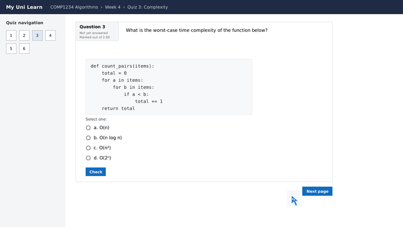
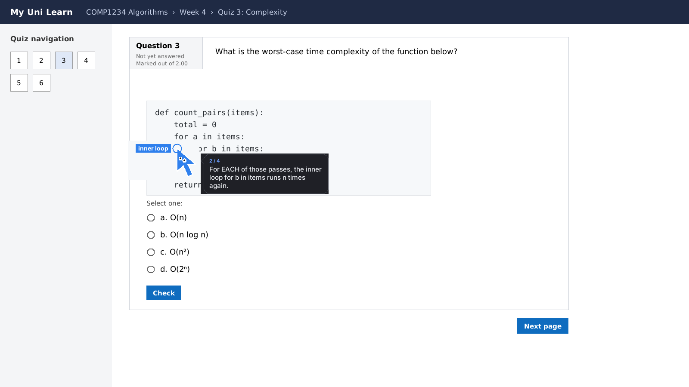
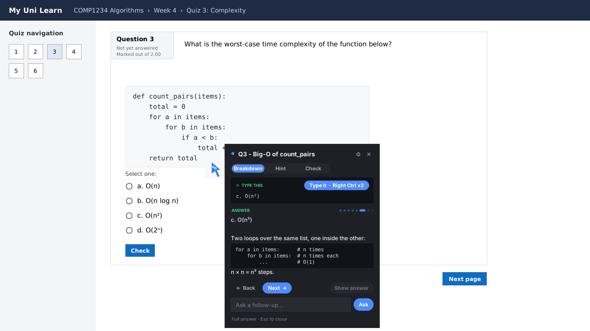
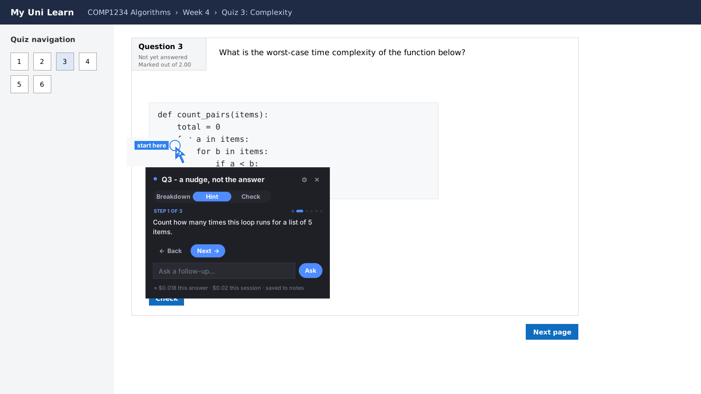
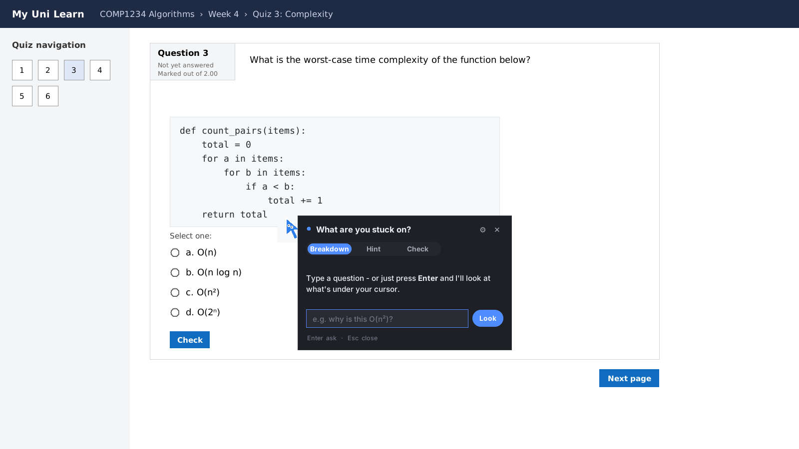
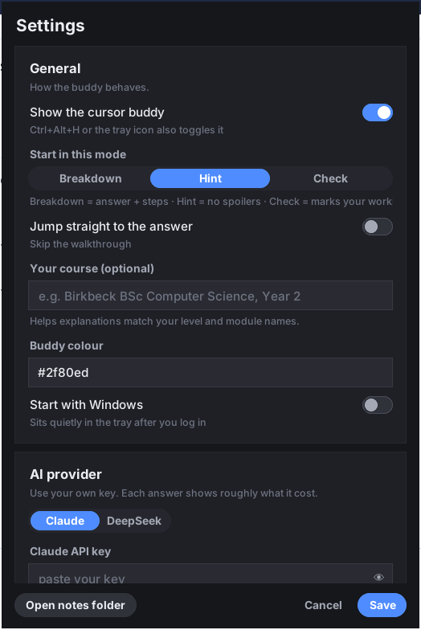
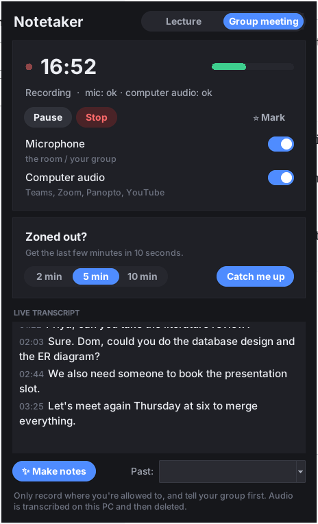
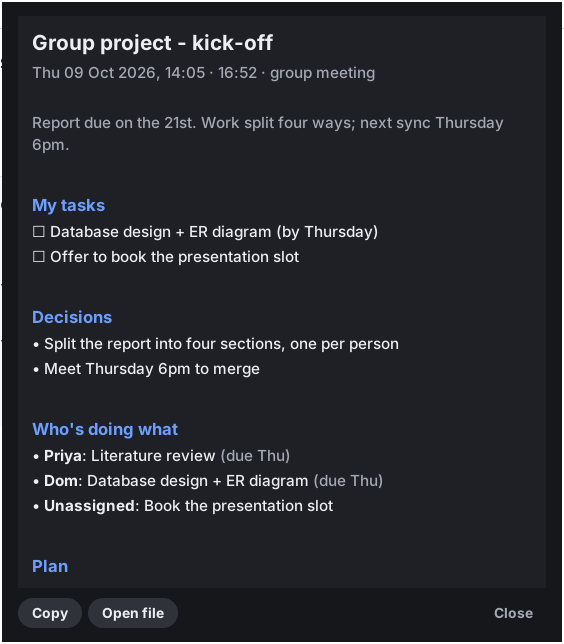

# MoodleClicky

**A study buddy that lives next to your mouse cursor.** Stuck on a Moodle question, a coursework task or an error in your code? **Double-tap Right Ctrl.** MoodleClicky looks at your screen, flies over to the right spot, and talks you through it one small step at a time in a **little speech bubble** right next to it. No chatbot window, no big pop-up, no pressing Enter. If you're typing in a box, it suggests what goes there. **Double-tap Right Ctrl again** and it types it in for you.



> Personal Windows desktop app. Works with **Claude** or **DeepSeek**. Inspired by [Clicky](https://github.com/farzaa/clicky) for Mac, built for studying.
> Also has a **lecture and meeting notetaker** that records, transcribes on your PC, and catches you up if you zone out.

---

## Install (Windows), one command

Open **PowerShell** (Start → type *PowerShell* → Enter) and paste:

```powershell
irm https://raw.githubusercontent.com/WastedPatriot/MoodleClicky/main/install.ps1 | iex
```

It downloads the latest version, adds **Start menu + Desktop** shortcuts, then opens a quick **setup menu right in the terminal**: pick Claude or DeepSeek, paste your API key (hidden as you type), and add your name, your course, start-with-Windows and notetaker options. Then it launches MoodleClicky into your system tray. No Python and no admin rights needed.

| I want to… | Do this |
|---|---|
| **Update** to the newest version | Run the same command again. Your settings, keys and notes are kept |
| **Change settings** later | Start menu → **MoodleClicky Setup**, or tray icon → Settings |
| **Uninstall** | Start menu → **Uninstall MoodleClicky**. It asks whether to keep your notes |
| Install from a zip you already downloaded | `.\install.ps1 -Zip C:\path\to\MoodleClicky-windows.zip` |

**Got an older copy you downloaded by hand?**
1. Right-click the tray icon (bottom-right, by the clock) and choose **Quit**.
2. Delete the folder you unzipped it into.
3. Run the install command above.

If you'd turned on *Start with Windows*, the new install takes that over automatically.

<details><summary>Run from source instead (for tinkering)</summary>

Install **Python 3.11+** from [python.org](https://www.python.org/downloads/) (tick *"Add python.exe to PATH"*). Download this repo, then double-click **`run.bat`**. The first run sets everything up.
</details>

## Keys

| Keys | What it does |
|---|---|
| **Right Ctrl, Right Ctrl** (double-tap) | Look at what's under your mouse **right now** and explain it |
| **Right Ctrl ×2** again | Type the ✍ suggestion into the box you were typing in (Ctrl+Z undoes it) |
| **Ctrl + Alt + Space** | Type a question first ("why is this O(n²)?") |
| **Ctrl + Alt + H** | Show or hide the cursor buddy |
| **Ctrl + Alt + N** | Open the lecture / meeting notetaker |
| **Ctrl + Alt + M** | ⭐ Mark "this bit matters" while recording (highlighted in your notes) |
| **← / →** | Previous / next step in the pop-up |
| **Esc** | Close the pop-up |

**Why Right Ctrl?** Tapping Ctrl on its own does nothing in browsers, Word or code editors, so it never gets in the way. Ctrl+C, Ctrl+V, Ctrl+click and holding Ctrl don't count. It's the **Right** Ctrl because double-tapping *Left* Ctrl is PowerToys' **Find My Mouse** spotlight. Prefer something else? Settings → **Wake-up key**: either Ctrl ×2, Right Ctrl ×1, or the classic Ctrl+Alt+Space.

### 💬 Speech bubble

The answer arrives Clicky-style:
- **A small speech bubble** sits right beside the cursor buddy and types itself out.
- **The buddy grows** while it's thinking and talking, so you can see it, then shrinks back.
- **It walks you through it:** what the question is asking, then each step (the buddy flies to the bit of the screen it's talking about), then the answer and why.
- **Then it fades away** on its own.

It never gets in the way:
- **Clicks go straight through** the bubble and the buddy.
- **Your cursor stays in the box you were typing in.**
- **Esc** hides it.

Want the whole thing at once, with Back/Next and follow-up questions? Tray icon → **Show full answer**, or turn off *Speech bubble* in Settings for the big card.

### ✍ Typing help

When you call the buddy while you're writing in a box (a Moodle answer, a forum post, an essay, a line of code), the pop-up shows a **Type this** card. Depending on what you're doing, that's:
- the answer for the box
- the rest of your sentence
- the next line(s) of code

Double-tap Right Ctrl again, or click **Type it**, and it's pasted at your cursor. Your clipboard is put back afterwards. In **Hint** mode it only gives you a starter, never the full answer.

### ⚡ Speed

Replies stream in: the title and summary appear as soon as they're written, and the rest follows. Settings → **Speed vs depth** picks **Fast** (the default, a few seconds), Balanced or Thorough.

You can change all of these in Settings (⚙ in the pop-up, or right-click the tray icon).

## Three modes

| Mode | What you get |
|---|---|
| **Breakdown** (default) | What the question is really asking, then the steps one at a time, with the buddy pointing at each part, then the answer, why it works, and a quick "check yourself" question |
| **Hint** | Nudges only, no answer. For when you want to get there yourself |
| **Check** | Write your answer first, then it marks your working and points at what's off |

Switch modes in the pop-up at any time. You can also type follow-up questions ("why n squared?") in the box at the bottom.

## Screenshots

| Speech bubble: talking you through it | Full answer (tray → Show full answer) |
|---|---|
|  |  |
| **Hint mode: no spoilers** | **Ask anything** |
|  |  |



## 🎙️ Lecture and meeting notetaker

For lectures (in person, Teams, Zoom or Panopto) and group-project meetings, especially when you can't give it 100% attention.

1. **Ctrl + Alt + N** (or tray → *Lecture / meeting notetaker*), pick **Lecture** or **Group meeting**, then press **Start**.
2. It records your **microphone and/or computer audio** and transcribes it **on your PC** (free, offline speech-to-text with Whisper). The live transcript scrolls as it goes.
3. Zoned out? Press **Catch me up** (2, 5 or 10 minutes). You get what's being discussed right now, what you missed, anything aimed at **you**, and something sensible to say if you're put on the spot.
4. Press **Make notes** at the end:
   - **Lecture**: summary, key points, concepts explained, examples, your ⭐ moments, to-dos and deadlines, "test yourself" questions.
   - **Group meeting**: decisions, who's doing what, **your tasks** (set your name in Settings), and a step-by-step plan.

| Live notetaker | Meeting notes it writes |
|---|---|
|  |  |

**Built not to lose your notes:**
- The transcript is saved as it happens. If the laptop dies mid-lecture, reopen the session under **Past** and make notes from what was saved.
- If your mic gets unplugged, it keeps retrying.
- If no sound is playing, recording carries on regardless.
- Audio is deleted once it's transcribed.

Only record where you're allowed to, and tell your group first.

## Revision notes, for free

Every explanation is saved as Markdown, one file per day, in
`%APPDATA%\MoodleClicky\notes\`. Open the folder from the tray menu, then revise from it or paste it into OneNote or Obsidian.

## Cost and privacy

- You use **your own API key**. Each pop-up shows roughly what that answer cost and the running total for the session.
  - Claude Opus 5.5: about $0.01–0.03 per question.
  - DeepSeek Flash: a fraction of a cent.
- A screenshot is taken **only when you press the hotkey**. It's sent to the AI provider you picked and isn't stored anywhere else.
- Lecture audio never leaves your PC. Only the text transcript goes to the AI, and only when you press *Catch me up* or *Make notes*.
- Your API keys are stored in **Windows Credential Manager**, not in a text file.

## How it works

```
hotkey ─► hide own windows ─► screenshot the monitor under the cursor (cursor ringed)
       ─► Claude / DeepSeek returns JSON: title, summary, steps[{text, x, y}], answer, why, check_yourself
       ─► buddy flies to each step's (x, y) ─► pop-up pages through the steps
```

| File | Job |
|---|---|
| `moodleclicky/app.py` | Wiring: hotkeys (pynput), tray icon (pystray), worker threads |
| `moodleclicky/triggers.py` | Double-tap Right Ctrl (or either Ctrl) wake-up key (ignores Ctrl+C etc.) |
| `moodleclicky/typer.py` | Types a suggestion into the box you were in (refocus, paste, restore clipboard) |
| `moodleclicky/brain.py` | Prompt, JSON schema, Claude and DeepSeek backends, cost estimate |
| `moodleclicky/capture.py` | Screenshot of the right monitor; maps the AI's coordinates back to the screen |
| `moodleclicky/buddy.py` | The cursor buddy (follows you, flies to targets, thinking dots) |
| `moodleclicky/bubble.py` | The pop-up (pages, back/next, show answer, follow-ups) |
| `moodleclicky/settings_ui.py` / `config.py` | Settings window, and settings stored in `%APPDATA%\MoodleClicky` |
| `moodleclicky/notes.py` | Daily revision notes |
| `moodleclicky/lecture/` | Notetaker: `audio.py` (mic + loopback recorder), `transcribe.py` (Whisper), `session.py` (crash-safe sessions), `summarise.py` (notes, meeting plan, catch-up) |
| `moodleclicky/lecture_ui.py` | Notetaker window + notes viewer |
| `moodleclicky/theme.py` | Shared dark theme: pill buttons, segmented controls, toggles, cards |
| `moodleclicky/selftest.py` | `MoodleClicky.exe --selftest`: checks the build end to end, offline |

## Development

```bash
pip install -r requirements.txt pytest ruff bandit
pytest -q                                   # core tests (no API calls, fake client)
ruff check . && bandit -q -r moodleclicky   # lint + security scan
xvfb-run -a -s "-screen 0 1600x900x24" python tests/ui_smoke.py   # drives the real windows (Linux)
xvfb-run -a -s "-screen 0 1600x900x24" python tools/make_docs.py  # regenerates the screenshots + GIF
```

Build the Windows app yourself: `tools\build_exe.bat`. It runs PyInstaller, then self-tests the built `.exe`, and writes the output to `dist\MoodleClicky-windows.zip`. CI does the same on every push, and every green build on `main` publishes the Release that the install command downloads.

**Troubleshooting:** everything is logged to `%APPDATA%\MoodleClicky\moodleclicky.log`. Run `MoodleClicky.exe --selftest report.txt` to check an install.

## Use it fairly

This tool is built for **learning**: breakdowns, hints and checking your own work. Check your university's rules before using any AI help during assessed quizzes or exams.

MIT licence.
